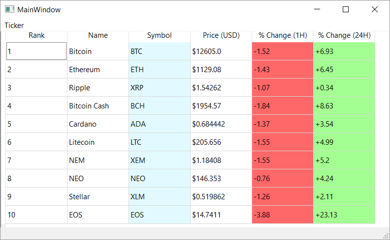

# CryptoTicker
#### Cryptocurrency Live Ticker implemented in Python (3.5) using PyQt5 and CoinMarketCap API

The .exe can be found within /dist/tickergui
Dependencies: Requests, PyQt5, JSON

Screenshot:

